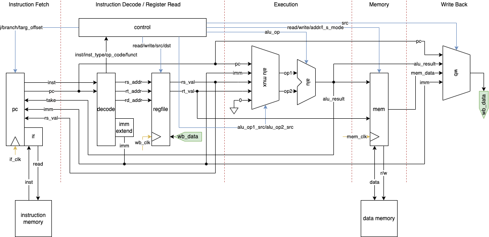
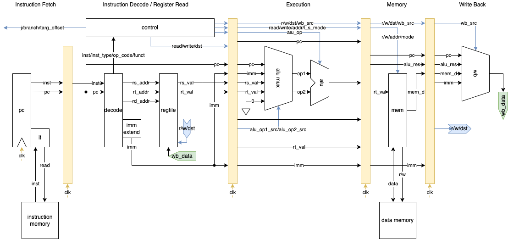
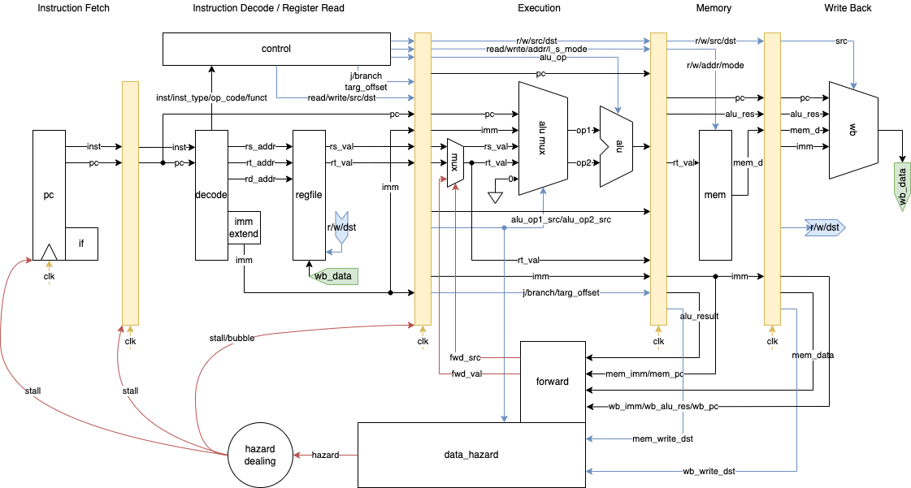
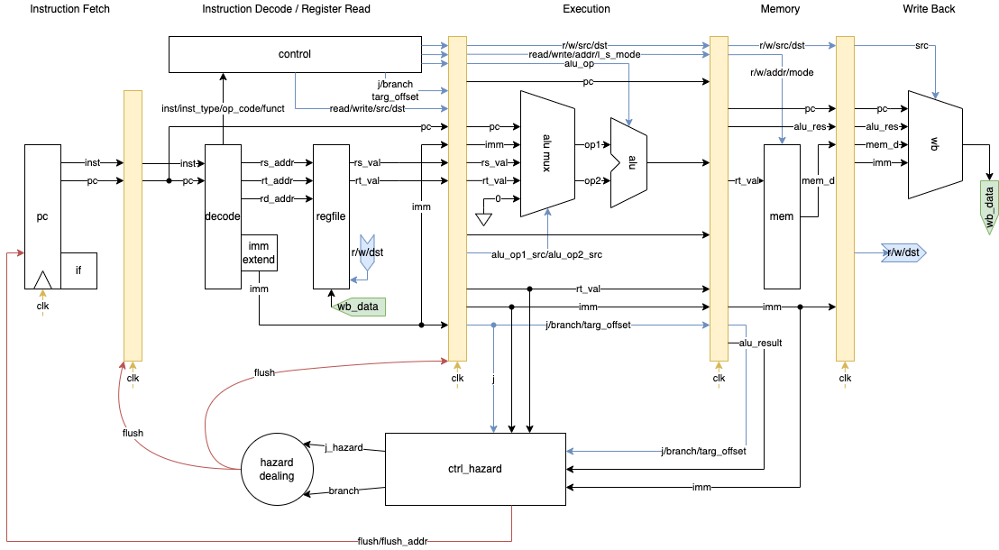

# MIPSLAB

Extension of computer orgnization courseworks in XJTU; implementing some CPUs, all providing a 42 instructions subset of MIPS ISA.

By Junyang Zhang.

## How to run

The project has a testbench also written in Verilog HDL, thus using any simulator other than [Verilator](https://www.veripool.org/verilator/) would be suffice. It is recommended to use [Icarus Verilog](http://iverilog.icarus.com/) as a simulator, and other platforms such as [Modelsim](https://eda.sw.siemens.com/en-US/ic/modelsim/), [Vivado](https://china.xilinx.com/products/design-tools/vivado.html), [Quartus](https://www.intel.com/content/www/us/en/software/programmable/quartus-prime/download.html) are yet to be tested.

### Installing Icarus Verilog

It is recommended to work with Linux or Unix-like systems. If you wish to install Icarus Verilog in Windows (without WSL), please do some research.

In MacOS: ([Homebrew](https://brew.sh/))

```sh
brew install iverilog
```

In Debian based distributions: ([apt-get](https://www.debian.org/doc/manuals/debian-handbook/sect.apt-get.zh-cn.html))

```sh
sudo apt-get iverilog
```

### Running simulation

First, clone this repository and `cd` into it.

```sh
git clone https://github.com/James-Hen/MIPSLAB.git
cd MIPSLAB
```

I wrote a handy make script to simulate and generate waveforms.

```sh
make
```

Then the vvp files and waveforms of all targets will be generated in `target/`. Read the waveform with [GTKWave](http://gtkwave.sourceforge.net/), [WaveTrace](https://www.wavetrace.io/), etc.

The target can be selected to build such as `make single_cycle`, `make multicycle`, `make pipeline`.

## Testing

Currently, no auto testing scripts of MIPS ISA are deployed. But anyone could run the processor with their self-written assembly language text and data, generated by [MARS](http://courses.missouristate.edu/kenvollmar/mars/). Please assemble the `.asm` files and load the `.text` segment into `sim/imem.text`, and `.data` segment into `sim/dmem.data`, as hexadecimal text files. The simulatior will read those files and load them into the debug memories.

Some handy assembly programs are given in `sim/MIPS_sample_src`.

## Architecture Overview

The projects now includes four CPU implementation with different architectures, have a quick look to see what will happen.

### Single Cycle Version

The single cycle version is the basis of all variants, which consists of all necessary components. The datapath is illustrated below.



As you can see, the diagram is splitted into 5 stages, which will run in turns by each clock signal. On every positive edge of the clock signal, there would be exactly one stage that is active. This counting is implemented by a counter in `common/single_cycle/counter.v`, which sends out 5 different sub-clock signals.


Also, to fit in a narrower sense, I implemented a *pure* single cycle version, in which each instruction only takes a cycle. For more information, checkout the branch `PureSingleCycle`.

### Multicycle Version

The multicycle version is just a small improvement of the single cycle version, which instead of asking every stage to run sequentially, skips some or all stages after decoding. This method requires to tailor the stage footprint for every instructions. Fortunately, the types are not too much, since all instructions need "IF" and "ID" stages.

For example, the instruction "LUI" only needs "IF", "ID" and "WB", since the immediate is generated in the "ID" stage; and "ADD" need "IF", "ID", "EX" and "WB", skipping memory accesses.

So, the only modification is about the counter. The counter now need to have `op_code` from "ID" stage, and decide which stages shall be run, and send sub-clocks.


One can see that, it does a non-trivial speedup by adding some trivial work.

In the multicycle version, I implemented a unified memory (both the instruction memory and data memory), for the sake of coursework requirements.

### Pipeline Version

The multicycle version is good, though, but take a further step, how can we utilize every stage at a given moment? So we let the instructions flow trough the stages like a pipeline, making following modifications to the datapath.



We can see that every stage will be active at any clock period, and the results of each stage will be hold in registers for the next stage; but it won't work well in most situations, because:

- Some instructions will not get the propriate data, which is the result of the previous instruction, e.g. `lui $0, 0`, followed by `andi $0, 123`;
- Some instructions will not get the propriate data, which is the result of the previous load, e.g. `lw $0, 0($1)`, followed by `addi $0, -1`;
- The program counter will proceed indefinitely, and won't branch or jump.

We shall solve the first two problems together first, and produce codes for forwarding and hazard.



Here I ignored the instruction memory and the data memory for simplicity. The `forward` module is added to forward the results and values from "EX/MEM" and "MEM/WB" stage to the "EX" stage, solving the first problem.

Also, the `data_hazard` module integrated into the `forward` module would identify the second problem, and send the hazard signal to the `hazard_dealing` module, which will accordingly stall the stages and add bubbles.

#### Assume not take

Then, let's solve the final problem: jumps and branches. The signal of jumping will not appear until the "ID/EX" stage, and the branch taking will not appear until the "EX/MEM" stage. Thus the `ctrl_hazard` module should identify them, and generate the flush address.



While the `pc` module still fetches instructions every cycle, and assuming the branches and jumps are not taken. This is why the stages must be flushed if jump or taken branches occur.


#### 2-bit Branch Prediction and Branch Target Buffer

Not finished yet.